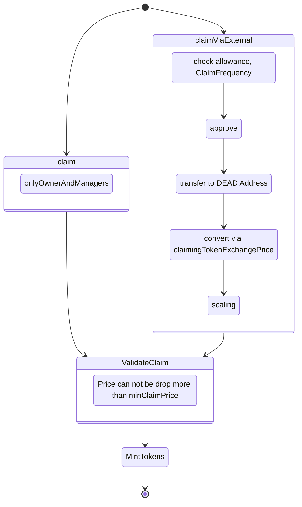

# TradedTokenContract
A straightforward token contract for early investors to gradually begin selling on public exchanges

**[Power your next token with Intercoin smart contracts!](https://community.intercoin.app/t/power-your-next-token-with-intercoins-smart-contracts/2832)**

Intercoin's TradedTokenContract has been carefully designed, from the bottom up, to its holders massive confidence. Unlike most tokens out there, it can guarantee things like:

💧 **Auto-Liquidity**: Project managers don't have to worry about adding too much or too little liquidity to the trading pool. As more people buy the token, it can automatically mint small amounts of itself, to swap and grow both sides of the liquidity pool. **[This helps reduce slippage for holders,](https://redefine.net/media/uniswap/)** without requiring liquidity providers to expose themselves to risk of impermanent loss

🔒 **Locked Liquidity**: All the auto-liquidity that's added to the pool is locked there permanently, because the token contract sends the LP tokens to the zero address. Thus, any participant can easily verify on-chain that all those LP tokens can truly never be recovered. This is in contrast to other projects that fake "liquidity locking" by sending LP tokens to some contract address, which may turn out to be recoverable after all. **[This helps protect holders from rugpulls.](https://cointelegraph.com/explained/crypto-rug-pulls-what-is-a-rug-pull-in-crypto-and-6-ways-to-spot-it)**

😱 **Anti-Panic**: When deploying the token contract, the project team can choose to limit the rate at which people can sell to, say, 5% per day (configurable parameter). This means panic sell-offs can be slowed down, to take place over multiple days, and during that time, new buyers can appear, or the team can try to stabilize whatever external situation is causing the panic. **[This helps protect the crowd from each other's herd mentality](https://www.washingtonpost.com/wellness/2022/10/31/seoul-crowd-crush-how-to-survive/)**.

🚰 **Anti-Dilution**: Insiders, such as the team and presale investors, are limited in how much of the token they can mint to themselves. The system is designed to guarantee that if all those tokens were sold, the price would only drop from the all-time-high by, say, 10% (configurable parameter). Our **[ClaimManager contract](https://github.com/Intercoin/TradedTokenContract/blob/main/contracts/ClaimManager.sol)** helps insiders fairly distribute the tokens available to them from time to time. **[This helps protect holders from massive monetary inflation in the token.](https://learn.bybit.com/crypto/inflationary-vs-deflationary-cryptocurrency/)**

🙌 **Trade In Old Token**: If you have a previous token that you issued, even if it's on another chain, we can help you set up a system to let people gradually bridge and swap over into the new token at a certain rate (configurable parameter). All the Anti-Dilution rules described above still apply, but in addition, the people have to hold the old token. **[This helps give a way for holders of the old token to gradually migrate over into your new, more secure, ecosystem.](https://mantraomniverse.medium.com/om-token-v2-migration-step-by-step-guide-e26e04196d29)**

🎁 **Presale Support**: The token contract supports designating other smart contracts to conduct pre-sales, before liquidity is added to the Uniswap trading pool. For this purpose, we recommend using Intercoin's **[FundContract](https://github.com/Intercoin/FundContract)**, which has features such whitelists, prices, tranches, and even group discounts! Together, our smart contracts can give holders confidence that no one got the token without buying it for a specific floor price. **[This helps protect people from dumping by those who may have received it via an airdrop or in exchange for some off-chain arrangements.](https://ontropy.substack.com/p/why-99-of-airdrops-dump)**

🛒 **Buy and Sell Taxes**: Intercoin's token contract also supports setting a tax rate for buying, and a separate rate for selling (configurable parameters). The taxes can even be set to increase or decrease gradually over a period, such as a year, so people know exactly what to expect. Tokens collected via taxes are immediately burned, **[which can be used to balance the minting to insiders and for auto-liquidity, or even to make the token hyper-deflationary!](https://www.yahoo.com/video/deflationary-tokens-empower-crypto-project-153845806.html)**

## Claiming
The diagram below shows how TradedTokens can be claimed

## Common features
####<b>to be described</b> 
&nbsp;&nbsp;<b>1.</b> Params (eg PreventPanic) 
&nbsp;&nbsp;<b>2.</b>Presale 
&nbsp;&nbsp;<b>3.</b>AddInitialLiquidity 
&nbsp;&nbsp;<b>4.</b>GradualTaxes 
&nbsp;&nbsp;<b>5.</b>Claiming and RestrictClaiming 
&nbsp;&nbsp;<b>6.</b>AddLiquidity 

